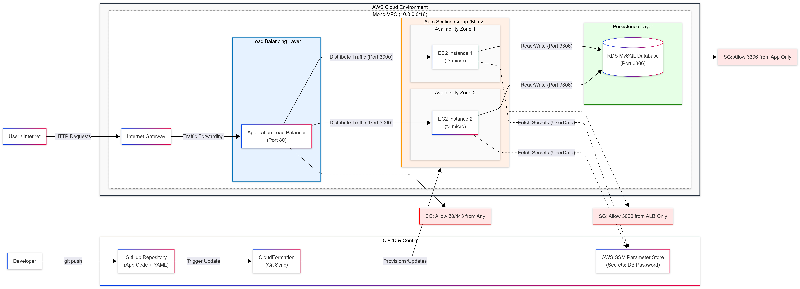

AWS CloudFormation: 3-Tier App(Classic-Monolith)

This project automates the deployment of a scalable Three-Tier Architecture on AWS. It leverages Infrastructure as Code (IaC) to provision a secure, production-ready environment for a Node.js application backed by a MySQL RDS database, replacing manual configuration with a repeatable CloudFormation template.

Architecture

  We use a standard 3-tier pattern to decouple the application logic from the database and public interface.

    Presentation: Application Load Balancer (ALB) handles SSL offloading and traffic distribution.

    Application: Node.js running on Ubuntu 24.04 LTS. Instances are managed by an Auto Scaling Group (ASG) for elasticity.

    Data: Amazon RDS (MySQL 8.x) sits in a private subnet.

Tech Stack & Services Used

    Compute: EC2 (Ubuntu 24 LTS) + Auto Scaling Groups.

    Database: Amazon RDS (MySQL).

    Networking: VPC, Public/Private Subnets, Route Tables, NACLs, Security Groups.

    Process Management: PM2.

    IaC & CI/CD: AWS CloudFormation (Git Sync).

Configuration Notes

  A few design decisions to keep in mind for this demo:

Secrets Management: In a real production environment, we'd strictly use AWS Systems Manager (SSM) or Secrets Manager. For this public demo, the database password is hardcoded in the template to avoid extra permission setup for users cloning the repo.

Env Variables: We don't use external config scripts. The EC2 UserData script injects the DB credentials directly into the PM2 ecosystem file during boot. This ensures the app always comes up with the right config without dependency issues.

Deployment Guide

1. Connect GitHub to AWS

  First, you need to authorize AWS to see this repo.

    Go to Developer Tools > Settings > Connections in the AWS Console.

    Create a new GitHub connection and authorize it.

    Here i allowed access only to this specific repo

2. Create Stack (Git Sync)

  We deploy directly from the repo using CloudFormation's "Sync from Git" feature.

    Go to CloudFormation > Create Stack.

    Choose Sync from Git.

    Repo Details:

      Provider: GitHub.

      Repository: ashwinseenu/monolith-to-cloud-devops.

      Branch: main.

      File Path: monolith-stack-deploy.yaml.

    IAM Role: Select the pre-configured gitbot role.

Parameters:

    KeyName: Your existing EC2 Keypair.

    DBPassword: The hardcoded password (or your own if you changed it).

    InstanceType: t2.micro or t3.micro.

Deploy: Acknowledge the IAM creation capabilities and hit Submit.

Testing & Validation

Once the stack is CREATE_COMPLETE, test as below

    Resilience Test: Terminate one EC2 instances in the console. Watch the Auto Scaling Group detect the health check failure and spin up a replacement automatically.

    Traffic Routing: With the ALB DNS URL, initiate sessions from multiple browser environment or sessions to check whether traffic routed to different instances in different availability zones.

    Data Persistence: Add an item to the inventory via the UI. Reboot the web server. If the item is still there after the reboot, the RDS connection is solid and data is persisting correctly outside the compute layer.

Lessons Learned

