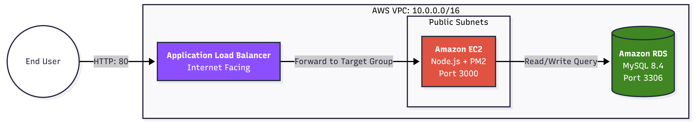

📖 Overview

This repository demonstrates a legacy-style monolithic application deployed on Amazon Web Services (AWS) using Infrastructure as Code (IaC) with AWS CloudFormation.

The project showcases how a traditional Node.js + MySQL monolith can be provisioned, configured, deployed, and operated in a production-like cloud environment using modern DevOps and cloud engineering best practices.

Key highlights:

Monolithic Node.js inventory application with CRUD operations

EC2-based deployment with automated bootstrapping

Secure environment variable injection using CloudFormation

RDS-backed MySQL database

Process management and auto-restart using PM2 + systemd

Real-time EC2 metadata visibility (Instance ID & AZ)

